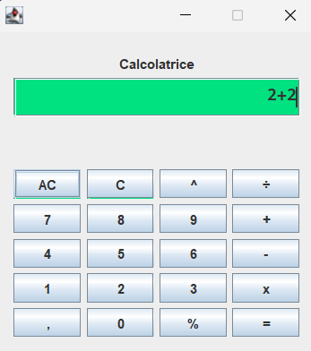

# Calcolatrice Java GUI

Una semplice calcolatrice da scrivania sviluppata in Java con interfaccia grafica Swing. Supporta le quattro operazioni base, oltre a potenza e modulo, con un motore di calcolo scritto da zero che rispetta la precedenza degli operatori.



## Funzionalità

- Operazioni supportate: `+` `-` `x` `÷` `%` `^`
- Rispetto della precedenza degli operatori (le operazioni "hop" — moltiplicazione, divisione, modulo, potenza — vengono calcolate prima di quelle "lop" — addizione e sottrazione)
- Supporto ai numeri decimali
- Validazione dell'espressione: controlla che gli operatori e i punti decimali siano posizionati correttamente prima di procedere al calcolo
- Gestione degli errori: mostra `Errore` in caso di espressioni non valide o eccezioni (es. divisione per zero non gestita numericamente)
- Tasti `AC` (cancella tutto) e `C` (cancella l'ultimo carattere)
- Possibilità di confermare il calcolo anche premendo Invio nel campo di testo

## Struttura del progetto

```
├── Calcolatrice.java       # Logica di calcolo (parsing e valutazione dell'espressione)
├── GUICalcolatrice.java    # Interfaccia grafica Swing e gestione degli eventi
└── Main.java               # Esecutore del programma
```

### `Calcolatrice.java`

Classe che si occupa della logica pura di calcolo:

- `popolaTermini()` scompone la stringa di espressione in un `Vector` di termini numerici e operatori (es. `"3.5*2+1"` → `[3.5, *, 2, +, 1]`)
- `risultato()` valuta i termini rispettando la precedenza: prima le operazioni ad alta precedenza (`hop`: `*`, `/`, `%`, `^`), poi quelle a bassa precedenza (`lop`: `+`, `-`)
- Include controlli di validità sia per gli operatori (`sonoOperatoriValidi()`) sia per i numeri decimali (`sonoDecimaliValidi()`)

### `GUICalcolatrice.java`

Classe che costruisce l'interfaccia grafica con Swing:

- Layout a griglia 5x4 per i pulsanti (numeri, operatori, `AC`, `C`, `=`)
- Un campo di testo (`JTextField`) che funge da schermo, allineato a destra
- Gestisce la pressione dei pulsanti tramite `ActionListener`, effettua la sostituzione dei simboli grafici (`x` → `*`, `÷` → `/`, `,` → `.`) prima di passare l'espressione a `Calcolatrice`

## Come eseguire il programma

1. Assicurati di avere il **JDK** installato (versione 17 o superiore, per via del metodo `getLast()` su `Vector`).
2. Compila i file:

   ```bash
   javac Calcolatrice.java GUICalcolatrice.java Main.java
   ```

3. Esegui il main:

   ```bash
   java Main
   ```

## Note e possibili miglioramenti
- Non è presente una gestione esplicita della divisione per zero: al momento produce `Infinity`, `-Infinity` o `NaN`, che vengono comunque intercettati dalla GUI prima della scrittura successiva.

## Licenza
GPL-3.0
